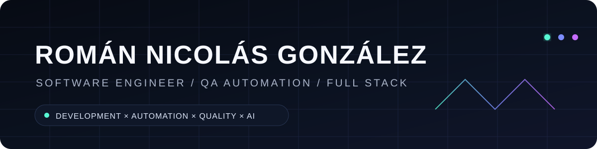

 

### I build software — and the systems that prove it works.

**QA Automation · Full Stack Engineering · API Testing · AI-assisted Quality**

---

## 01 / Engineering profile

I'm **Román Nicolás González**, a Software Developer & QA Engineer from Buenos Aires with **4+ years of experience in software quality**, validating web applications, REST APIs and backend systems.

My strongest work lives where **development and quality engineering meet**: understanding a product, finding its risks, building the solution, automating its validation and integrating those checks into the delivery workflow.

`BUILD` → `TEST` → `AUTOMATE` → `VERIFY` → `SHIP`

---

## 02 / Core stack

<table>
<tr>
<td width="50%" valign="top">

### Development

</td>
<td width="50%" valign="top">

### Quality engineering

</td>
</tr>
</table>

---

## 03 / Featured build

<table>
<tr>
<td width="100%">

### ◈ [AI QA Agent](https://github.com/romangon10/AI-QA-Agent)
**Quality engineering for the AI era.**

A futuristic QA engineering workspace built around a simple idea: software generation is getting faster, so **verification has to get smarter too**. The project combines test-scenario generation, automated execution, quality signals and CI into one experience.

**What it demonstrates**

`AI-assisted QA` · `Playwright` · `E2E automation` · `GitHub Actions` · `Quality gates`

</td>
</tr>
</table>

---

## 04 / Selected systems

| Project | Engineering focus | Technology |
| :--- | :--- | :--- |
| **[CUCULICH](https://github.com/romangon10/CUCULICH)** | Premium responsive fashion experience with a black-and-gold visual identity | React · Vite · Framer Motion |
| **[Hacker Web Simulation](https://github.com/romangon10/Hacker-Web-Simulation)** | Interactive browser simulation backed by deterministic automated checks | JavaScript · Playwright · CI |
| **[Colmena Market](https://github.com/romangon10/Colmena-Market)** | Full-stack commerce flow with API validation and relational persistence | Node.js · SQLite · REST |
| **[Universos Paralelos](https://github.com/romangon10/Universos-Paralelos)** | Experimental interface and interactive visual storytelling | HTML · CSS · JavaScript |

---

## 05 / Quality mindset

<table>
<tr>
<td align="center"><b>01</b> UNDERSTAND THE RISK</td>
<td align="center">→</td>
<td align="center"><b>02</b> DESIGN THE TEST</td>
<td align="center">→</td>
<td align="center"><b>03</b> AUTOMATE THE CHECK</td>
<td align="center">→</td>
<td align="center"><b>04</b> PROTECT THE RELEASE</td>
</tr>
</table>

I work across **functional testing, regression, exploratory testing, REST API validation, test-case design, defect analysis and automated E2E checks** — with reproducible evidence and clear technical documentation.

---

## 06 / Current direction

> ### QA Automation × Full Stack × Artificial Intelligence
>
> Building toward engineering workflows where software isn't only developed faster — **it's continuously verified.**

Currently deepening my work with **Playwright, CI/CD, React, Node.js, Python and AI-assisted testing workflows**.

---

### Build with intent. Test with evidence. Ship with confidence.

[**LinkedIn**](https://www.linkedin.com/in/romannicolasgonzalez/) · [**Repositories**](https://github.com/romangon10?tab=repositories) · [**Email**](mailto:gonzalezromannicolas@gmail.com)

Buenos Aires, Argentina · Software Engineering / Quality Engineering

